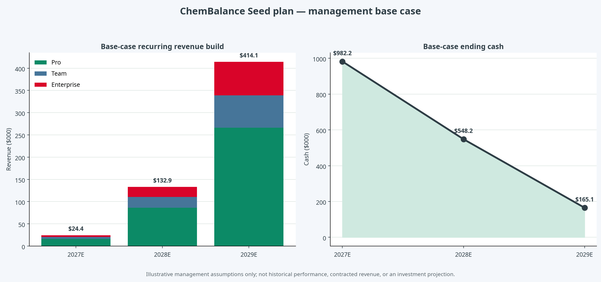

# طرح کسب‌وکار و برنامهٔ مالی مرحلهٔ Seed — ChemBalance

**نسخه:** ۱٫۰
**تاریخ مرجع:** ۲۶ اوت ۲۰۲۶
**واحد مالی:** دلار آمریکا؛ مگر آن‌که خلاف آن ذکر شده باشد
**دامنه:** برنامهٔ عملیاتی و مالی برای جذب سرمایهٔ Seed؛ نه پیشنهاد اوراق بهادار، ارزش‌گذاری یا تضمین عملکرد.

## خلاصهٔ اجرایی

ChemBalance یک نرم‌افزار دسکتاپ محلی برای موازنهٔ دقیق واکنش‌های شیمیایی است. نسخهٔ فعلی Windows، ورودی فرمول‌های پیچیده، موازنه با ضرایب صحیح، کنترل پایستگی اتم و بار، جرم مولی، تاریخچهٔ محلی و خروجی متنی را در یک تجربهٔ کاربری واحد ارائه می‌کند. کد محصول، آزمون‌ها و نسخهٔ منتشرشده در مخزن عمومی قابل‌مشاهده‌اند.[1]

تز سرمایه‌گذاری این است که ChemBalance از یک مسئلهٔ کوچک اما پرتکرار وارد می‌شود: حذف اصطکاک و ابهام از موازنهٔ واکنش. سپس با افزودن تحلیل درصد جرمی، نمودارهای استوکیومتری، تبدیل‌های جرم/مول، واکنش‌دهندهٔ محدودکننده و خروجی‌های گزارش‌پذیر، به یک فضای کاری حرفه‌ای برای آموزش، آزمایشگاه و محتوای علمی گسترش می‌یابد. کسب‌وکار نباید بر پایهٔ این فرض باشد که «همهٔ دانشجویان» مشتری پرداخت‌کننده‌اند؛ ورود به بازار باید با پایلوت‌های قابل‌اندازه‌گیری در آموزش عالی آغاز و سپس به قراردادهای Team و Enterprise گسترش یابد.

برنامهٔ پایهٔ این سند، یک **Seed illustrative به مبلغ ۱٫۳۵ میلیون دلار** را مفروض می‌گیرد. این مبلغ، یک تصمیم یا پیشنهاد تأمین مالی واقعی نیست؛ یک نقطهٔ برنامه‌ریزی برای محاسبهٔ بودجه و runway است. در سناریوی پایه، هزینهٔ ۳۶ ماهه به ساخت قابلیت‌های Pro، انتشار native برای Windows/macOS/Linux، اعتماد توزیع (code signing/notarization)، پایلوت، فروش اولیه و عملیات اختصاص می‌یابد. مدل به‌طور آگاهانه درآمد تاریخی یا قرارداد امضاشده را فرض نمی‌کند.

> **اصل اعتبار:** هر عدد فروش، هزینه، CAC، قیمت، نرخ ماندگاری یا استفاده از سرمایه در این طرح، یک «مفروضهٔ مدیریتی سناریویی» است، مگر آن‌که صریحاً با عنوان محصول منتشرشده یا سند منبع معرفی شده باشد. تمام مفروضات قابل‌ویرایش در مدل Excel همراه این سند ثبت شده‌اند.

| موضوع | وضعیت فعلی | نتیجهٔ مورد انتظار از Seed |
|---|---|---|
| محصول | نسخهٔ Windows و هستهٔ دقیق موازنه منتشر شده است | تبدیل به محصول چندسکویی با لایهٔ تحلیل استوکیومتری |
| بازار اول | فرضیهٔ آموزش عالی و استفادهٔ حرفه‌ای سبک | ۳ تا ۵ پایلوت ساختاریافته و اثبات مورد استفادهٔ تکراری |
| مدل درآمد | طرح Community / Pro / Team / Enterprise | آزمون قیمت‌گذاری و تبدیل پایلوت به مشتری پرداخت‌کننده |
| توزیع | انتشار Windows و CI/CD | چهار بستهٔ native با کنترل یکپارچگی و فرایند قابل‌تکرار انتشار |
| سرمایه | پیش‌درآمد در مدل پایه | ۳۶ ماه بودجهٔ برنامه‌ریزی‌شده و آمادگی برای داده‌های round بعدی |

## ۱. مسئله، فرصت و پاسخ محصول

موازنهٔ واکنش در آموزش شیمی، کار آزمایشگاهی و توسعهٔ محتوا یک عملیات تکرارشونده است. مسئلهٔ کاربر همیشه «پیدا کردن یک ضریب» نیست. کاربر به ورود درست فرمول‌های پیچیده، نتیجهٔ قابل‌توضیح، امکان کنترل پایستگی، سرعت انجام کار و خروجی قابل‌استفاده در گزارش یا کلاس نیاز دارد. ابزارهای بسیار ساده معمولاً نتیجه را از مسیر کار جدا می‌کنند؛ ابزارهای صرفاً ابری نیز برای محیط‌هایی که به نصب محلی، دسترس‌پذیری آفلاین یا کنترل داده اهمیت می‌دهند، همیشه مناسب نیستند.

ChemBalance این شکاف را با ترکیب یک هستهٔ محاسباتی دقیق و یک رابط محلی پر می‌کند. تمایز محصول در «پاسخ قابل‌بررسی» است: موازنهٔ ریاضی، کنترل اتم‌ها و بار، جرم مولی و خروجی در کنار هم قرار می‌گیرند. این تعریف عمداً دامنهٔ محصول را محدود می‌کند؛ ChemBalance امکان‌پذیری شیمیایی، مسیر واکنش، مخاطرات یا ایمنی آزمایش را تأیید نمی‌کند. مرزبندی روشن، هم از نظر مسئولیت محصول و هم از نظر اعتماد سازمانی ضروری است.

| مسئلهٔ کاربر | پاسخ ChemBalance امروز | گسترش برنامه‌ریزی‌شده |
|---|---|---|
| موازنهٔ فرمول‌های پیچیده | موتور دقیق، گروه‌های تو‌در‌تو، هیدرات‌ها و بار یونی | تحلیل گام‌به‌گام و کتابخانهٔ مثال‌ها |
| کنترل پاسخ | جدول پایستگی اتم و بار | گزارش کنترل و export حرفه‌ای |
| محاسبات پیرامونی | جرم مولی و تاریخچهٔ محلی | درصد جرمی، تبدیل مول/جرم، محدودکننده و بازده نظری |
| نیاز استقرار | برنامهٔ Windows و انتشار checksum | macOS Intel/Apple Silicon و Linux با CI/CD native |
| نیاز سازمانی | local-first و خروجی متنی | پشتیبانی، استقرار کنترل‌شده و گزینه‌های Team/Enterprise |

## ۲. محصول و نقشهٔ توسعه

### وضعیت محصول

نسخهٔ فعلی ChemBalance Desktop باید به‌عنوان «محصول اولیهٔ قابل‌دمو و قابل‌نصب» عرضه شود، نه به‌عنوان یک پلتفرم کامل شیمی. این دقت در تعریف، مانع از تورم roadmap می‌شود و به تیم اجازه می‌دهد هر قابلیت جدید را با رفتار واقعی مشتری اعتبارسنجی کند. کیفیت کنونی بر هستهٔ قابل‌آزمون، رابط دسکتاپ، تاریخچهٔ محلی و انتشار قابل‌تکرار تکیه دارد.[1]

### اولویت‌های ۳۶ ماهه

| دوره | اولویت محصول | معیار خروج از مرحله |
|---|---|---|
| ماه ۰ تا ۶ | تثبیت Windows، ساخت native Linux، آغاز macOS، تحلیل درصد جرمی و نمودارهای پایه | نصب موفق، عدم رگرسیون در آزمون‌ها، استفادهٔ تکراری در پایلوت |
| ماه ۶ تا ۱۲ | تبدیل‌های جرم/مول، واکنش‌دهندهٔ محدودکننده، export گزارش و نسخهٔ Pro اولیه | حداقل یک جریان کاری حرفه‌ای که کاربر برای آن زمان یا هزینه ذخیره‌شده گزارش کند |
| ماه ۱۲ تا ۱۸ | Team workflow، ابزارهای مدرس، بهبود نصب و پشتیبانی | تبدیل حداقل یک پایلوت به پرداخت؛ بهبود onboarding براساس دادهٔ استفاده |
| ماه ۱۸ تا ۲۴ | Enterprise discovery، استقرار کنترل‌شده، پشتیبانی و اعتماد توزیع | اثبات نیاز سازمانی از طریق قرارداد یا LOI؛ نه صرفاً علاقهٔ کیفی |
| ماه ۲۴ تا ۳۶ | توسعهٔ کانال شریک و تصمیم دربارهٔ round بعدی | تکرارپذیری فروش، retention، و دادهٔ unit economics برای تصمیم سرمایه |

این roadmap به‌جای وعدهٔ فهرست بلند قابلیت‌ها، بر دروازه‌های تصمیم متکی است. اگر پایلوت نشان دهد تحلیل درصدی ارزش کافی ایجاد نمی‌کند، هزینهٔ توسعهٔ بخش‌های پیشرفته‌تر باید متوقف یا بازتعریف شود. اگر یک بخش سازمانی نیازهای استقرار غیرمتناسب ایجاد کند، باید به‌صورت یک محصول یا سرویس جداگانه قیمت‌گذاری شود.

## ۳. مشتری هدف و ورود به بازار

سه بخش اصلی مشتری وجود دارد، اما یک ترتیب روشن برای ورود ضروری است. در مرحلهٔ Seed، بازار اول «آموزش عالی و مدرس‌های شیمی» است؛ زیرا گروه کاربر قابل‌شناسایی، سناریوی استفادهٔ واضح و امکان اجرای پایلوت محدود دارد. آزمایشگاه‌ها و گروه‌های R&D مشتریان مجاور هستند که پس از اثبات قابلیت گزارش و تحلیل حرفه‌ای باید هدف‌گیری شوند. ناشران و ارائه‌دهندگان آموزش، کانال توزیع و همکاری محسوب می‌شوند، نه صرفاً خریدار مستقیم.

| بخش | کاربر نهایی | خریدار اقتصادی | مورد استفادهٔ اصلی | مسیر فروش پیشنهادی |
|---|---|---|---|---|
| آموزش عالی | دانشجو، مدرس، دستیار آموزشی | مدیر گروه یا مدیر فناوری آموزشی | یادگیری مفهومی و بازخورد سریع | نسخهٔ Community → پایلوت کلاسی → Team |
| آزمایشگاه و R&D سبک | شیمی‌دان، پژوهشگر، تکنسین | مدیر آزمایشگاه یا R&D | محاسبهٔ تکرارپذیر و خروجی قابل‌ثبت | Demo بر سناریوی واقعی → Pro/Team |
| ناشر و آموزش‌دهنده | طراح دوره و مدرس | مدیر محتوا یا محصول | افزوده‌شدن ابزار به دوره و محتوا | شریک محتوا → توزیع یا white-label |

### پیام بازار

پیام اصلی باید نتیجه‌محور باشد: «موازنهٔ دقیق و قابل‌بررسی، در یک فضای کاری محلی.» برای مدرس، این پیام به «نمایش چرایی پایستگی» ترجمه می‌شود. برای کاربر حرفه‌ای، به «محاسبهٔ تکرارپذیر و خروجی قابل‌ثبت». برای مدیر فناوری، به «نرم‌افزار محلی، قابل‌استقرار و با مسیر انتشار کنترل‌شده» تبدیل می‌شود. ادعای «بهترین» یا «تنها» بودن بدون دادهٔ مقایسه‌ای نباید استفاده شود.

## ۴. مدل کسب‌وکار و درآمد

مدل پیشنهادی، یک قیف Community-to-Pro-to-Organization است. نسخهٔ Community باید کیفیت موازنهٔ پایه را حفظ کند؛ هدف آن اعتمادسازی، کشف تقاضا و گسترش نمونه‌های استفاده است. پرداخت باید برای ارزش قابل‌اندازه‌گیری باشد: تحلیل، نمودار، export، بهره‌وری، پشتیبانی و نیازهای استقرار تیمی.

| بسته | ارزش پیشنهادی | قیمت مدل پایه | وضعیت اعتبارسنجی |
|---|---|---:|---|
| Community | موازنهٔ دقیق، کنترل پایستگی، تاریخچهٔ محلی | رایگان | مسیر رشد و جذب بازخورد |
| Pro | تحلیل درصدی، نمودار، استوکیومتری و خروجی پیشرفته | ۱۸۰ دلار سالانه | **مفروضهٔ مدل؛ نیازمند آزمون willingness-to-pay** |
| Team | پشتیبانی، تنظیمات گروهی و استقرار سبک | ۱٬۵۰۰ دلار ACV سالانه | **مفروضهٔ مدل؛ نیازمند پایلوت** |
| Enterprise | استقرار کنترل‌شده، پشتیبانی و نیازهای سازمانی | ۷٬۵۰۰ دلار ACV سالانه | **مفروضهٔ مدل؛ نیازمند discovery سازمانی** |

قیمت‌گذاری در این جدول، ارزش‌گذاری بازار یا نرخ قابل‌اتکا تلقی نمی‌شود. این ارقام تنها اجازه می‌دهند پیوند بین منطق محصول، فرضیهٔ فروش و نیاز سرمایه در مدل مالی دیده شود. پیش از عرضهٔ عمومی نسخهٔ Pro، قیمت باید با مصاحبهٔ مشتری، آزمایش بسته‌بندی و رفتار تبدیل نسخهٔ رایگان آزموده شود.

## ۵. برنامهٔ فروش و بازاریابی

برنامهٔ Go-to-Market بر فروش حجمی زودهنگام بنا نمی‌شود. هدف ۹۰ روز نخست، یادگیری ساختاریافته است: مسئلهٔ تکرارشونده چیست، چه کسی بودجه دارد، چه قابلیت یا خروجی‌ای سبب پرداخت می‌شود و چرخهٔ تصمیم چقدر طول می‌کشد. سپس، پایلوت‌ها باید به مطالعهٔ موردی و دارایی فروش تبدیل شوند.

| مرحله | اقدام | خروجی لازم | معیار تصمیم |
|---|---|---|---|
| کشف | ۱۵ تا ۲۰ مصاحبهٔ مسئله‌محور | ماتریس مسئله، نقش خریدار، اعتراض و واژگان مشتری | دو یا سه مسئلهٔ تکرارشونده و قابل‌حل |
| پایلوت | ۳ تا ۵ پایلوت محدود در محیط آموزشی | مالک پایلوت، معیار موفقیت، جلسهٔ بازبینی | استفادهٔ تکراری و رضایت از نتیجهٔ قابل‌مشاهده |
| تبدیل | پیشنهاد Pro/Team متناسب با پایلوت | قیمت، حوزهٔ پشتیبانی، استقرار و زمان‌بندی | پرداخت، LOI یا دلیل مستند عدم خرید |
| تکرار | انتشار case study و شریک محتوا | دارایی فروش و کانال معرفی | کاهش زمان فروش و رشد ورودی مناسب |

کانال‌های اولیه شامل فروش مستقیم بنیان‌گذار به گروه‌های شیمی، محتوای آموزشی مسئله‌محور، شبکهٔ مدرس‌ها و شریک توزیع آموزشی هستند. تبلیغ فراگیر در مرحلهٔ Seed باید محدود باشد؛ تا زمانی که onboarding، pricing و retention شناخته نشده‌اند، هزینهٔ تبلیغ به‌سادگی به نصب بدون استفاده تبدیل می‌شود.

## ۶. عملیات، تیم و حاکمیت

تیم Seed باید کوچک و متقاطع باشد. اولویت با ظرفیت محصول/مهندسی، یادگیری مشتری و پشتیبانی اجراست؛ نه ایجاد لایهٔ سازمانی سنگین. استخدام یا برون‌سپاری باید تنها پس از تحقق دروازه‌های مشخص انجام شود.

| حوزه | مالکیت پیشنهادی | خروجی ۱۲ ماهه |
|---|---|---|
| محصول و مهندسی | بنیان‌گذار فنی + ظرفیت تکمیلی | نسخهٔ Pro اولیه، CI/CD native، کیفیت انتشار و تحلیل استوکیومتری |
| مشتری و GTM | بنیان‌گذار تجاری/محصول | مصاحبه، پایلوت، onboarding و تبدیل اولیه |
| طراحی و آموزش | همکار پاره‌وقت یا پیمانکار | Demo، راهنمای مدرس، محتوای use-case و design system |
| عملیات | خدمات حرفه‌ای سبک | ثبت حقوقی، حسابداری، قراردادهای پایلوت و حریم خصوصی |

به‌روزرسانی ماهانه برای سرمایه‌گذاران باید با یک داشبورد کوچک انجام شود: نصب فعال، فعال‌سازی، استفادهٔ هفتگی، پایلوت فعال، تبدیل به پرداخت، درآمد تکرارشونده، burn ماهانه، cash remaining، ریسک اول و تصمیم مورد نیاز. انتشار داده‌های خام یا معیارهای ظاهری مانند تعداد دانلود، جایگزین این داشبورد نیست.

## ۷. برنامهٔ مالی و منطق مدل

### مفروضات کلیدی

مدل مالی از صفر درآمد تاریخی آغاز می‌شود و به‌صورت عمدی محافظه‌کارانه، سودآوری ۳۶ ماهه را ادعا نمی‌کند. سناریوی پایه نشان می‌دهد آیا سرمایهٔ Seed برای رسیدن به نقاط اثبات محصول و بازار کفایت می‌کند، نه این‌که پیش‌بینی قطعی درآمد باشد. مفروضات کامل و فرمول‌های قابل‌ویرایش در فایل `ChemBalance_Seed_Financial_Model.xlsx` قرار دارد.

| مفروضه | ۲۰۲۷E | ۲۰۲۸E | ۲۰۲۹E | نوع |
|---|---:|---:|---:|---|
| Pro جدید | ۱۸۰ | ۶۰۰ | ۱٬۴۰۰ | مفروضهٔ acquisition |
| Team جدید | ۶ | ۲۰ | ۴۵ | مفروضهٔ acquisition |
| Enterprise جدید | ۱ | ۴ | ۱۰ | مفروضهٔ acquisition |
| قیمت Pro سالانه | ۱۸۰ دلار | ۱۸۰ دلار | ۱۸۰ دلار | مفروضهٔ بسته‌بندی |
| Team ACV سالانه | ۱٬۵۰۰ دلار | ۱٬۵۰۰ دلار | ۱٬۵۰۰ دلار | مفروضهٔ بسته‌بندی |
| Enterprise ACV سالانه | ۷٬۵۰۰ دلار | ۷٬۵۰۰ دلار | ۷٬۵۰۰ دلار | مفروضهٔ بسته‌بندی |
| هزینهٔ درآمد | ۹٫۰٪ درآمد | ۹٫۰٪ درآمد | ۹٫۰٪ درآمد | مفروضهٔ cloud/tool/support |
| سرمایهٔ Seed | ۱٫۳۵ میلیون دلار | — | — | مفروضهٔ برنامه‌ریزی |

### پیش‌بینی پایهٔ P&L و نقدینگی

فرمول درآمد در مدل برای هر بخش این است: `میانگین حساب‌های فعال × ACV سالانه`. میانگین حساب‌های فعال برابر با میانگین حساب‌های ابتدای و انتهای سال است؛ بنابراین مدل، تمام لوگوهای جدید را به‌صورت درآمد کامل یک‌ساله تلقی نمی‌کند. هزینهٔ درآمد برابر درآمد ضرب در ۹٫۰٪ است. free cash flow در مدل، `EBITDA منهای سرمایهٔ در گردش/ابزار` است و مالیات یا بدهی را در دورهٔ زیان‌دهی اعمال نمی‌کند.

| شاخص مالی، دلار هزار | ۲۰۲۷E | ۲۰۲۸E | ۲۰۲۹E |
|---|---:|---:|---:|
| درآمد | ۲۴٫۵ | ۱۳۲٫۹ | ۴۱۴٫۲ |
| هزینهٔ درآمد | (۲٫۲) | (۱۲٫۰) | (۳۷٫۳) |
| سود ناخالص | ۲۲٫۲ | ۱۲۰٫۹ | ۳۷۶٫۹ |
| حاشیهٔ ناخالص | ۹۱٫۰٪ | ۹۱٫۰٪ | ۹۱٫۰٪ |
| تحقیق و توسعه | (۲۱۰٫۰) | (۲۸۰٫۰) | (۳۵۰٫۰) |
| فروش و بازاریابی | (۹۰٫۰) | (۱۵۰٫۰) | (۲۴۰٫۰) |
| عمومی و اداری | (۷۰٫۰) | (۹۵٫۰) | (۱۳۰٫۰) |
| EBITDA | (۳۴۷٫۸) | (۴۰۴٫۱) | (۳۴۳٫۱) |
| سرمایهٔ در گردش و ابزار | (۲۰٫۰) | (۳۰٫۰) | (۴۰٫۰) |
| free cash flow | (۳۶۷٫۸) | (۴۳۴٫۱) | (۳۸۳٫۱) |
| سرمایهٔ Seed | ۱٬۳۵۰٫۰ | — | — |
| نقد پایان دوره | ۹۸۲٫۲ | ۵۴۸٫۲ | ۱۶۵٫۱ |

این سناریو نشان می‌دهد که سرمایهٔ ۱٫۳۵ میلیون دلاری، تحت مفروضات پایه، پوشش نقدینگی تا پایان ۲۰۲۹E فراهم می‌کند و شرکت را سودده فرض نمی‌کند. از این رو، هدف round Seed باید ایجاد شواهد کافی برای تصمیم‌گیری دربارهٔ سرمایهٔ بعدی باشد: retention، تبدیل، فروش سازمانی، چرخهٔ فروش و هزینهٔ جذب. هرگونه انحراف منفی از فروش یا افزایش هزینه باید به‌سرعت به سناریوی downside و دروازه‌های هزینه وصل شود.

### تحلیل حساسیت

سناریوها تنها ضریب جذب مشتری جدید را تغییر می‌دهند؛ قیمت و هزینه در سناریوی پایه نگه داشته می‌شوند تا حساسیت تجاری پنهان نشود. این یک تحلیل محدود است و جایگزین مدل کامل headcount، قرارداد و جریان نقدی ماهانه نیست.

| سناریو | ضریب جذب مشتری | درآمد ۲۰۲۹E، دلار هزار | نقد پایان ۲۰۲۹E، دلار هزار | تفسیر |
|---|---:|---:|---:|---|
| Downside | ۷۰٪ | ۲۹۰٫۰ | ۵۲٫۲ | چرخهٔ فروش طولانی‌تر یا تبدیل کمتر از انتظار |
| Base | ۱۰۰٪ | ۴۱۴٫۲ | ۱۶۵٫۱ | برنامهٔ مدیریت؛ نیازمند اثبات در پایلوت‌ها |
| Upside | ۱۳۰٪ | ۵۳۸٫۴ | ۲۷۸٫۰ | کانال شریک یا تبدیل بهتر از انتظار |

در سناریوی downside، نقد پایان برنامه به سطحی می‌رسد که تیم باید پیش از نزدیک‌شدن به آن، هزینه‌های اختیاری و سرعت استخدام را بازبینی کند. این مدل عمداً نشان می‌دهد که رشد درآمد به‌تنهایی جایگزین مدیریت هزینه نیست.

## ۸. استفاده از سرمایه و درخواست Seed

استفاده از سرمایه باید به milestones متصل باشد، نه به دسته‌بندی‌های مبهم بودجه. پیشنهاد برنامه‌ریزی پایه، تخصیص ۱٫۳۵ میلیون دلار به ترتیب زیر است.

| workstream | سهم | مبلغ، دلار هزار | دروازهٔ آزادسازی |
|---|---:|---:|---|
| محصول و مهندسی | ۴۵٫۰٪ | ۶۰۷٫۵ | انتشار پایدار چندسکویی و نسخهٔ Pro با استفادهٔ واقعی |
| GTM و موفقیت مشتری | ۲۵٫۰٪ | ۳۳۷٫۵ | پایلوت‌های ساختاریافته و conversion مستند |
| عملیات و اداری | ۱۵٫۰٪ | ۲۰۲٫۵ | ثبت، حسابداری، قرارداد و عملیات قابل‌مقیاس |
| اعتماد توزیع و امنیت | ۱۰٫۰٪ | ۱۳۵٫۰ | code signing، notarization و فرایند انتشار قابل‌اعتماد |
| ذخیرهٔ احتیاطی | ۵٫۰٪ | ۶۷٫۵ | فقط با تصویب ماهانه براساس runway و ریسک |
| **جمع** | **۱۰۰٫۰٪** | **۱٬۳۵۰٫۰** | **کنترل جمع در مدل Excel** |

این سند ارزش‌گذاری پیش‌پول، درصد سهام واگذارشده یا نوع ابزار سرمایه‌گذاری را توصیه نمی‌کند. انتخاب میان SAFE، priced equity round یا ساختار دیگر باید پس از روشن‌شدن حوزهٔ حقوقی، مالکیت فکری، ساختار شرکت، مالیات و مذاکره با سرمایه‌گذاران انجام شود.

## ۹. معیارهای موفقیت Seed و آمادگی round بعدی

پیش از رفتن به round بعدی، مدیریت باید شواهدی تولید کند که نشان دهد محصول فقط «قابل‌ساخت» نیست، بلکه «قابل‌فروش و قابل‌تکرار» است. معیارها باید با نقش و استفادهٔ مشتری همسو باشند.

| محور | معیار اصلی | آستانهٔ تصمیم پیشنهادی |
|---|---|---|
| فعال‌سازی محصول | تکمیل اولین موازنه و اولین خروجی در یک نشست | مسئلهٔ onboarding یا ارزش اولیه در صورت افت این شاخص بررسی شود |
| استفادهٔ تکراری | کاربران فعال هفتگی و بازگشت در ۳۰ روز | اگر بازگشت پایین است، پیش از هزینهٔ acquisition روی value loop کار شود |
| پرداخت | conversion Community به Pro و پایلوت به Team | قیمت و بسته‌بندی با آزمایش واقعی تنظیم شود |
| فروش سازمانی | زمان چرخهٔ فروش و تعداد ذی‌نفع | اگر چرخه طولانی است، مدل Team یا شریک توزیع بازطراحی شود |
| اقتصاد واحد | CAC، gross margin، retention و LTV/CAC | تنها پس از دادهٔ واقعی گزارش شود؛ هدف فرضی جای دادهٔ مشاهده‌شده را نمی‌گیرد |
| نقدینگی | burn ماهانه و ماه‌های runway | دروازهٔ کاهش هزینه پیش از افت نقد به سطح پرریسک فعال شود |

## ۱۰. ریسک‌ها و کاهش آن‌ها

| ریسک | احتمال / اثر | پاسخ عملی |
|---|---|---|
| کاربران ارزش کافی برای Pro درک نکنند | متوسط / بالا | مصاحبه و پایلوت پیش از ساخت کامل؛ تمرکز بر یک workflow حرفه‌ای قابل‌اندازه‌گیری |
| چرخهٔ فروش دانشگاه یا سازمان طولانی شود | بالا / متوسط | آغاز با پایلوت کوچک، self-serve Pro و شریک محتوا؛ عدم وابستگی کامل به Enterprise |
| نگهداری چندسکویی سرعت تیم را کم کند | متوسط / متوسط | build native در CI/CD، انتشار مرحله‌ای و اولویت‌دادن به پلتفرم‌های اثبات‌شده در پایلوت |
| اعتماد توزیع، امضای کد یا نصب مانع پذیرش شود | متوسط / بالا | اختصاص بودجه، code-signing/notarization و انتشار checksum |
| دامنهٔ محصول بیش از حد گسترده شود | بالا / متوسط | دروازهٔ roadmap براساس استفاده و پرداخت؛ توقف قابلیت‌های فاقد شواهد |
| ادعای شیمیایی بیش از دامنهٔ محصول | پایین / بالا | افشای صریح: محصول موازنهٔ ریاضی را کنترل می‌کند، نه feasibility یا ایمنی |
| نقدینگی زودتر از برنامه مصرف شود | متوسط / بالا | مرور ماهانهٔ runway، محدودکردن استخدام و استفاده از ذخیرهٔ ۵٪ فقط با milestone |

## ۱۱. برنامهٔ اجرای ۱۰۰ روز نخست پس از Seed

| بازه | اقدام | خروجی و تصمیم |
|---|---|---|
| روز ۱ تا ۳۰ | بسته‌کردن ثبت حقوقی، داشبورد cash، برنامهٔ محصول و ۱۵ مصاحبهٔ مشتری | تعریف ICP و معیار پایلوت؛ توقف فرضیه‌های ضعیف |
| روز ۳۱ تا ۶۰ | انتشار بستهٔ Linux/Windows و مسیر macOS، تحلیل درصدی اولیه، شروع ۳ پایلوت | دادهٔ نصب، استفاده و بازخورد workflow |
| روز ۶۱ تا ۱۰۰ | بهبود onboarding، آزمایش بسته‌بندی Pro، پیشنهاد تبدیل به مشتری پایلوت | نخستین سیگنال پرداخت و برنامهٔ کانال شریک |

## ۱۲. فهرست داده‌اتاق برای گفت‌وگوی سرمایه‌گذار

برای تبدیل این طرح به یک data room قابل‌دفاع، موارد زیر باید فراهم شود: ساختار حقوقی و cap table؛ مالکیت فکری و مجوزهای وابستگی؛ شرح معماری و سیاست حریم خصوصی؛ گزارش آزمون و release؛ گزارش استفاده و cohortهای واقعی؛ یادداشت‌های مصاحبهٔ مشتری؛ توافق‌های پایلوت و هر LOI؛ بودجه و bank statements؛ قراردادهای بنیان‌گذاران؛ و roadmap دارای مالک/زمان/هزینه. تا پیش از آماده‌شدن این موارد، ارقام این طرح باید به‌عنوان سناریوی مدیریت تلقی شوند، نه underwritten forecast.

## افشای مبنا و محدودیت‌ها

| عنصر افشا | شرح |
|---|---|
| مبنا | درآمد به دلار هزار از میانگین حساب فعال ضرب در ACV؛ هزینهٔ درآمد ۹٫۰٪ فروش؛ free cash flow برابر EBITDA منهای سرمایهٔ در گردش/ابزار در مدل محدود. |
| زمان | تاریخ مرجع ۲۶ اوت ۲۰۲۶؛ سه دورهٔ ۲۰۲۷E تا ۲۰۲۹E؛ سال مالی ۳۱ دسامبر به‌عنوان مفروضه. |
| مفروضات | سرمایهٔ Seed ۱٫۳۵ میلیون دلار، قیمت‌ها، جذب مشتری و هزینه‌ها همه سناریویی‌اند؛ هیچ درآمد تاریخی یا قرارداد امضاشده‌ای در مدل وارد نشده است. |
| منابع و اطمینان | وضعیت محصول از مخزن ChemBalance و مستندات release گرفته شده است.[1] مدل مالی و برنامهٔ بازار، مفروضات مدیریتی با اطمینان پایین تا اعتبارسنجی مشتری و دادهٔ مالی هستند. |
| انطباق | این سند پژوهش و تحلیل است و **توصیهٔ مالی یا سرمایه‌گذاری شخصی‌سازی‌شده نیست**. |

## منابع

[1]: https://github.com/Ali-Marandi/chembalance "ChemBalance — مخزن محصول، کد و انتشار نسخه"
